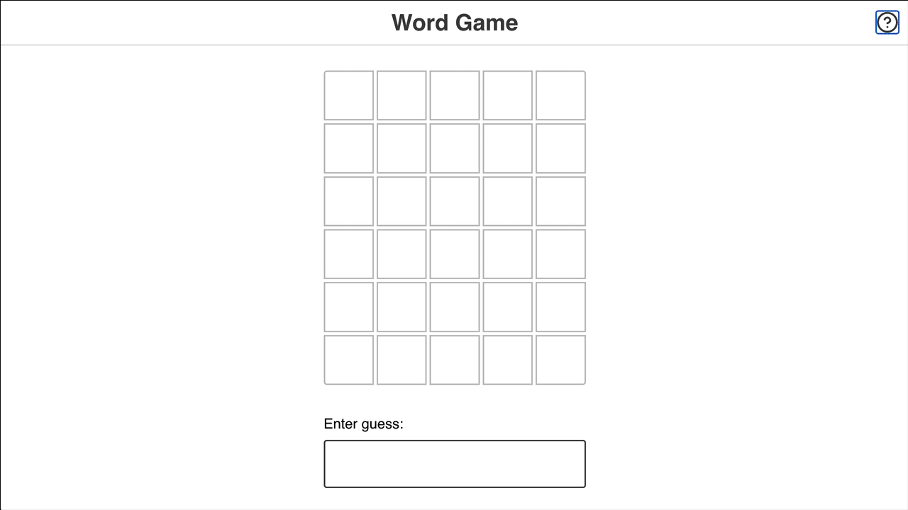

# Word Game - React + TypeScript + Vite

In this project, I'll recreate a popular online word game, Wordle:

In Wordle, users have 6 attempts to guess a 5-letter word. You're helped along the way by ruling out letters that aren't in the word, and being told whether the correct letters are in the correct location or not.

## Getting Started

This project is created with [Vite](https://vitejs.dev/), a modern JS build tool (Next Generation Frontend Tooling). It's intended to be run locally, requires [Node.js](https://nodejs.org/en/) version 18+.20+ and [pnpm](https://pnpm.io/).

> **NOTE: This project is tricky!**
>
> This project is mean to be challenging, because I believe that the best way to learn is to be challenged.
